# Dokumentasi Final Project DevOps

## Nama : Aditya Aprianto

#### Step 1 - Instalasi Nginx

Install nginx dengan perintah 'sudo apt install nginx' :

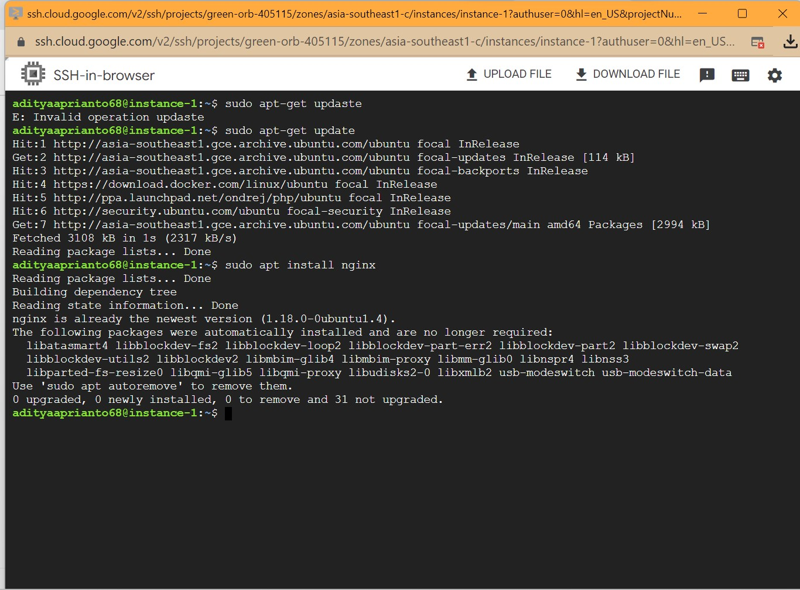

#### Step 2 - Konfigurasi Nginx Config

Lakukan Konfigurasi config pada file nginx dengan path /etc/nginx/sites-enabled dan pada file default (dapat diganti dengan nama file lain tetapi hanya satu file config saja dalam folder sites-enabled). Lalu setting proxy url dan port nya pada path location '/' seperti dibawah ini:

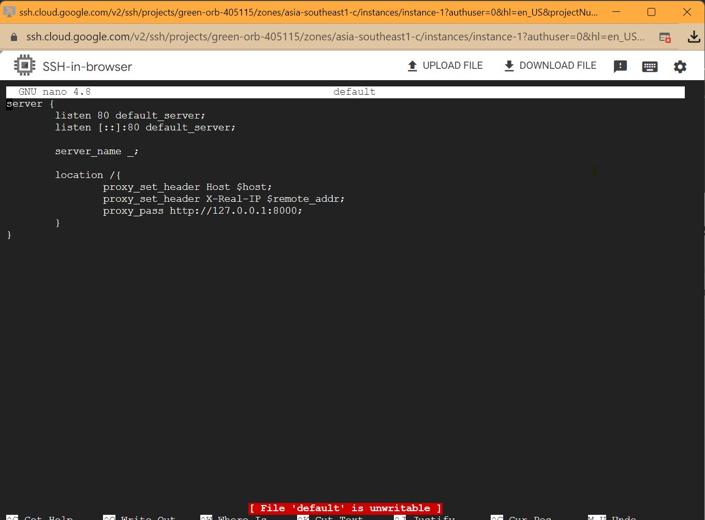

#### Step 3 - Install Docker

- Install package tambahan dengan perintah 'sudo apt-get install ca-certificates curl gnupg lsb-release'

- Menambahkan Docker Official GPG Key dengan perintah 'sudo mkdir -p /etc/apt/keyrings' dan 'curl -fsSL https://download.docker.com/linux/ubuntu/gpg | sudo gpg --dearmor -o /etc/apt/keyrings/docker.gpg'

- Setup Docker Repository dengan perintah
  'echo "deb [arch=$(dpkg --print-architecture) signed-by=/etc/apt/keyrings/docker.gpg] https://download.docker.com/linux/ubuntu $(lsb_release -cs) stable" | sudo tee /etc/apt/sources.list.d/docker.list > /dev/null'

- Install Docker Engine dengan perintah 'sudo apt-get update && sudo apt-get install docker-ce docker-ce-cli containerd.io docker-compose-plugin'

- Tambahkan group add docker dengan perintah 'sudo groupadd docker' lalu tambahkan user yang kita gunakan ke group docker dengan perintah 'sudo gpasswd -a $USER docker'

- Cek Versi Docker dengan perintah 'sudo docker --version'

  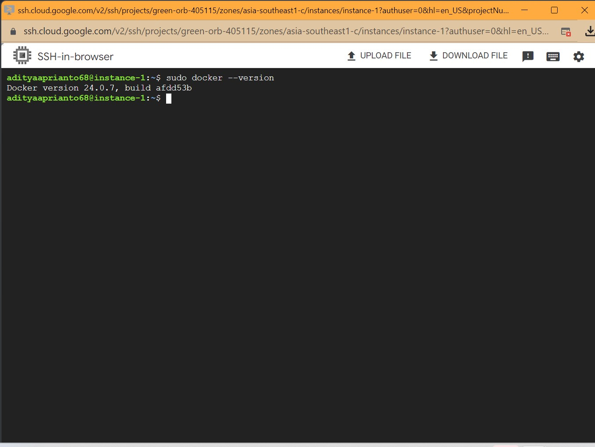

#### Step 4 - Clone Repository Project

Lakukan clone repo dari github atau gitlab kedalam server dengan perintah 'git clone https://nama-repo.git'.

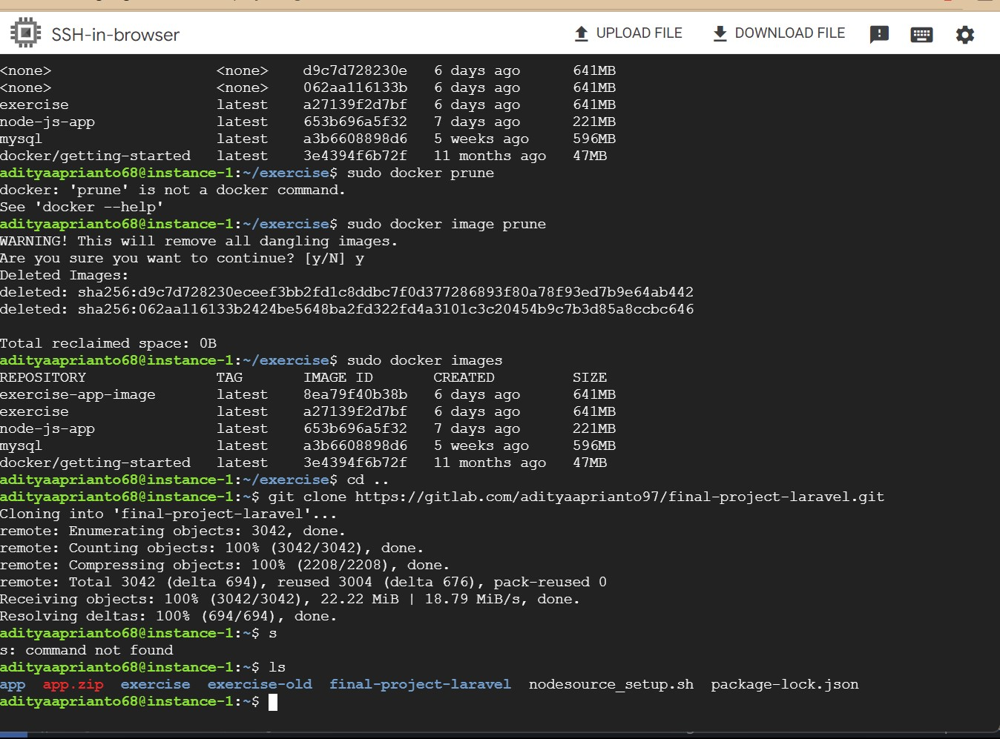

#### Step 5 - Setting Dockerfile dan compose

Buatlah sebuah Dockerfile dengan perintah 'sudo nano Dockerfile' dan isi file tersebut seperti berikut:
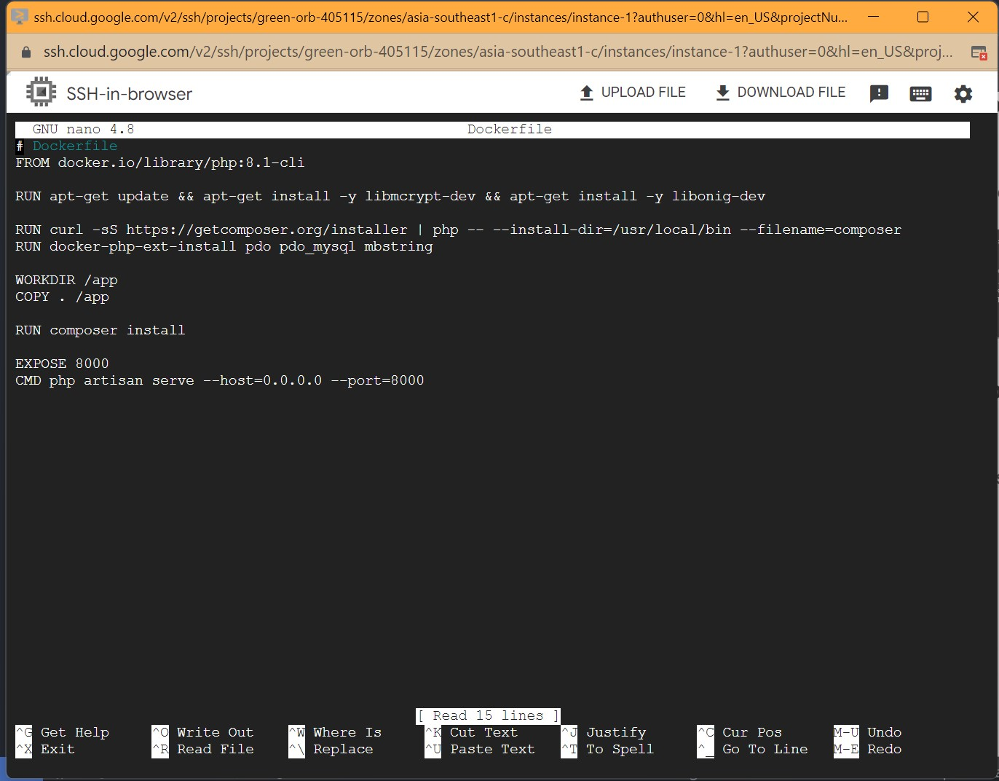

#### Step 6 - Setting Docker compose

Buatlah sebuah file docker-compose.yml dan isi seperti berikut ini:

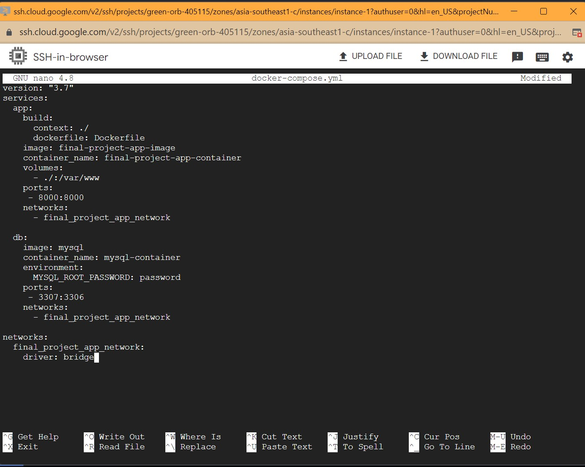

Ports pada bagian app dikonfigurasi dari port 8000 ke port 8000 laravel app agar bisa berjalan.

#### Step 7 - Setup Laravel Project

Setelah itu, setup laravel project yang sudah diclone dengan menjalankan 'composer install' untuk menginstall semua package laravel vendor serta menjalankan 'npm install' untuk menginstall semua node package module yang dibutuhkan. Setelah itu jalankan 'npm run prod' untuk nge build semua node package module pada bagian production.

#### Step 8 - Docker Build dan Docker Compose

Jalankan docker build untuk membuat image aplikasi dan menjalankan perintah yang ada di Dockerfile dengan perintah 'sudo docker compose build'

Setelah menjalankan perintah docker build, lakukan perintah compose up untuk membuat semua container yang diperlukan dengan perintah 'sudo docker compose up -d'

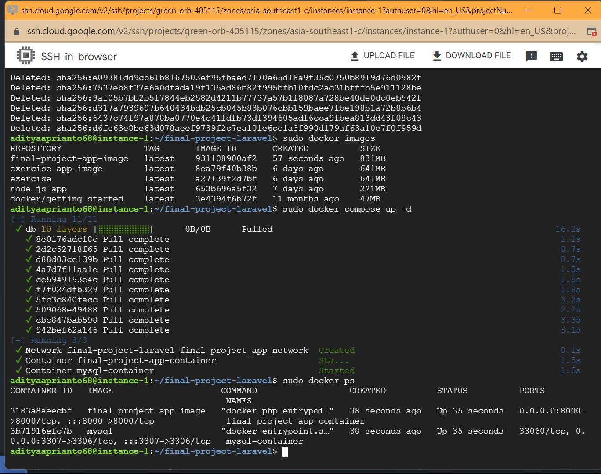

#### Step 9 - Restart Nginx and Migration

Lakukan restart nginx dengan perintah 'sudo service nginx restart' lalu lakukan migration dengan perintah 'php artisan migrate'. Sebelum itu kita harus masuk kedalam isi container terlebih dahulu dengan perintah 'sudo docker exec -it nama-container sh' setelah itu jalankan 'php artisan migrate'.

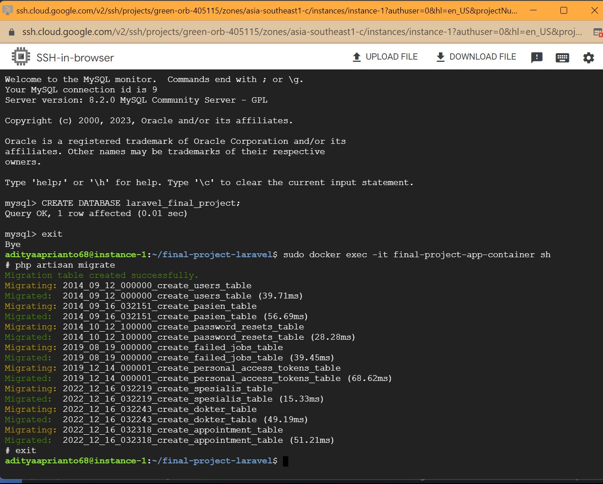

#### Step 10 - IP Static dan SSL

Langkah selanjutnya kita harus reverse IP menjadi static dan mengatur SSL nya. untuk mengubah IP menjadi static melalui menu network interface dan mengubah IP External dengan memilih REVERSE STATIC EXTERNAL IP ADDRESS. Lalu pada menu firewalls kita harus Allow HTTPS Traffic agar bisa menggunakan SSL. Settingannya sebagai berikut:

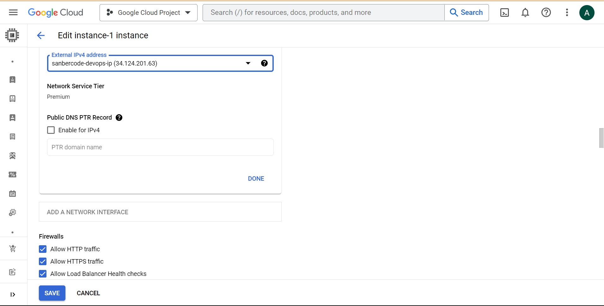

Setelah setting IP Static dan allow https nya. Kita harus menginstall certbot-nya dengan perintah 'sudo apt install certbot python3-certbot-nginx'. Setelah install cerbot kita harus membuat file dengan nama domain kita pada direktori /etc/nginx/sites-available. Isi dari file tersebut sebagai berikut:

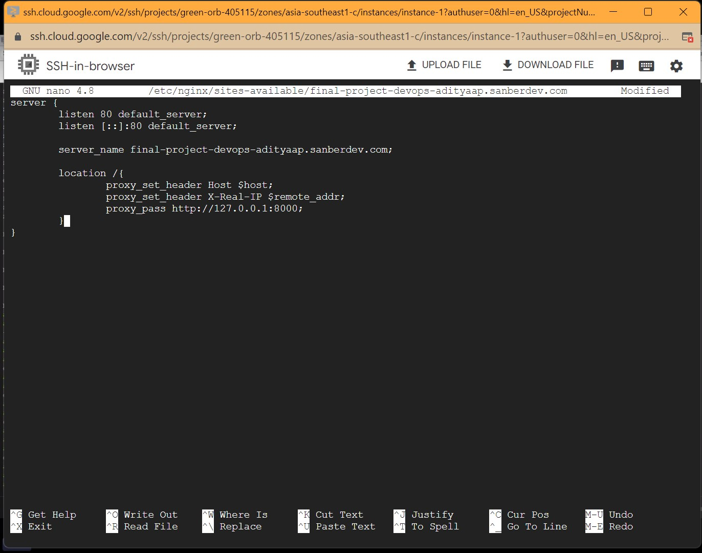

Lakukan restart nginx dengan perintah 'sudo service nginx restart' supaya menjalankan config yang baru. Lalu lakukan perintah 'sudo certbot --nginx -d your-domain.com' untuk mendapatkan sertifikat SSL-nya.

Setelah semua proses diatas selesai dijalankan, coba jalankan IP server / domain server yang kamu miliki dan tadaaa... Maka project laravel kamu berhasil terdeploy di cloud.

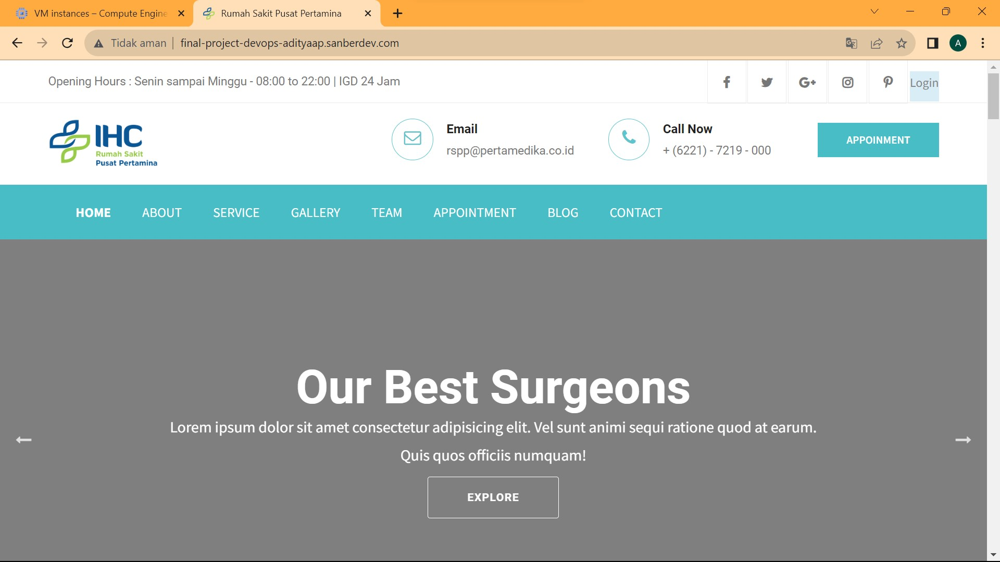

Akses Domain : https://final-project-devops-adityaap.sanberdev.com/
